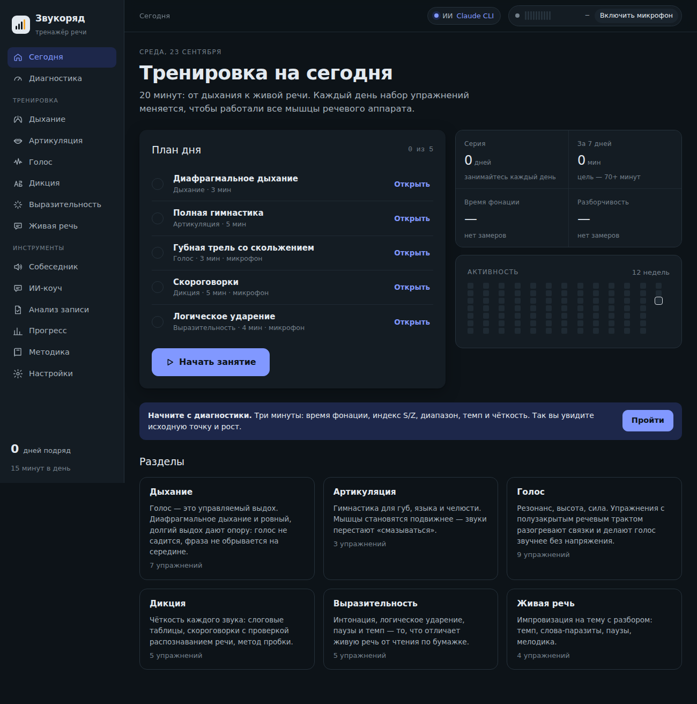

# Звукоряд

Тренажёр дикции, голоса и живой речи на русском. Работает в браузере. Замеры по микрофону, распознавание речи и разборы от ИИ-коуча. Есть голосовой собеседник, с которым можно тренировать разговор.



## Что умеет

- **Персональная программа.** Шесть навыков (дыхание, голос, дикция, выразительность, темп, чистота речи), у каждого — метрика и цель «хороший уровень». Фокус недели — два самых слабых навыка, контрольный замер раз в 7 дней, прогноз срока и дорожная карта по неделям.
- **План на каждый день (15–20 минут)** собирается от замеров: разминка → тренировка и замер фокусных навыков с целью недели → поддержка → живая речь.
- **Диагностика.** Время фонации, индекс S/Z, диапазон в полутонах, темп, разборчивость, мелодика, проседание громкости к концу фраз. По каждому показателю есть разбор.
- **Упражнения с микрофоном.** Долгий выдох и «Свеча», сирены и трели по живому графику высоты, проекция голоса, скороговорки и метод пробки с проверкой распознаванием речи, логическое ударение с анализом выделенности слов, «одна фраза — восемь смыслов».
- **Живая речь.** Импровизация на тему, «Минута без паразитов», голосовой собеседник в шести сценариях: беседа, собеседование, питч инвестору, дебаты, интервью, small talk. Во время разговора каждая ваша реплика разбирается сбоку: что хорошо, что сжёвано, есть ли слова-паразиты, по теме ли ответ.
- **ИИ-разборы после каждого упражнения** и текстовый ИИ-коуч.
- **Прогресс.** Графики по дням, серия занятий, история.

## Быстрый старт

1. Скачайте `zvukoryad-bridge.zip` из [Releases](../../releases) и распакуйте.
2. Установите [Node.js](https://nodejs.org) 18+ и Claude Code (`npm install -g @anthropic-ai/claude-code`, установщик с claude.com/claude-code или расширение для VS Code), затем один раз выполните `claude` и войдите.
3. Запустите `start-windows.cmd` (Windows) или `./start.sh` (macOS/Linux). Тренажёр откроется на `http://localhost:8787`.
4. В разделе «Настройки» по кнопке включаются Whisper (точное распознавание) и живые голоса Piper.

Без моста `zvukoryad.html` можно открыть и просто файлом в Chrome или Edge. Будут работать упражнения и распознавание браузера, но без ИИ, Whisper и голосов Piper.

## Как устроено

```
src/                    исходники тренажёра (без фреймворков)
  shell.html            разметка и шрифты
  style.css             дизайн, светлая и тёмная темы
  data.js               упражнения, скороговорки, тексты, сценарии, нормы
  engine.js             хранилище, микрофон, высота тона, распознавание, сравнение текста, просодия
  views.js              экраны, упражнения, ИИ, Whisper/Piper, собеседник
bridge/
  zvukoryad-bridge.mjs  локальный сервер на Node без зависимостей
  start-windows.cmd     запуск с автоперезапуском при обновлении
  start.sh
build.py                сборка в dist/
```

Сборка: `python3 build.py`. На выходе `dist/zvukoryad.html`, `dist/zvukoryad-bridge.zip` и `dist/index.html` (вариант для публикации как артефакт Claude).

### Мост (`bridge/zvukoryad-bridge.mjs`)

- **Раздача тренажёра** на `localhost`: там браузер даёт доступ к микрофону.
- **Claude.** Запросы уходят в Claude CLI пользователя (`claude -p`, stream-json). Собеседник работает в одной постоянной сессии, для разовых разборов держится заранее запущенный процесс. «Размышления» модели отключены, поэтому ответ приходит примерно за секунду.
- **Whisper.** Устанавливает whisper.cpp и модель large-v3-turbo. `whisper-server` держит модель в памяти.
- **Piper.** Устанавливает нейросетевые русские голоса (Ирина, Денис, Дмитрий, Руслан).
- **Скачивание.** Сначала напрямую, затем через системный прокси/VPN. Если не выходит — показывает прямые ссылки и забирает скачанные вручную файлы из «Загрузок».
- **Безопасность.** Слушает только `127.0.0.1`, на запросы отвечает только с ключом. Claude запускается без инструментов.

### Приватность

Анализ голоса, Whisper и Piper работают на компьютере пользователя. В Claude отправляются только текст расшифровки и цифры. Прогресс хранится в браузере, перенести его между копиями можно в «Настройки → Данные».

## Сторонние компоненты

Скачиваются мостом по запросу пользователя, в репозиторий не входят.

| Компонент | Лицензия |
|---|---|
| [whisper.cpp](https://github.com/ggml-org/whisper.cpp) и модели Whisper | MIT |
| [Piper](https://github.com/rhasspy/piper) | MIT |
| Голоса Piper `ru_RU` ([piper-voices](https://huggingface.co/rhasspy/piper-voices)) | у каждого голоса свой источник данных, см. MODEL_CARD (например, denis — CC0, irina — данные RHVoice) |
| Claude Code | используется ваш собственный аккаунт Claude |

## Лицензия

MIT — см. [LICENSE](LICENSE).
